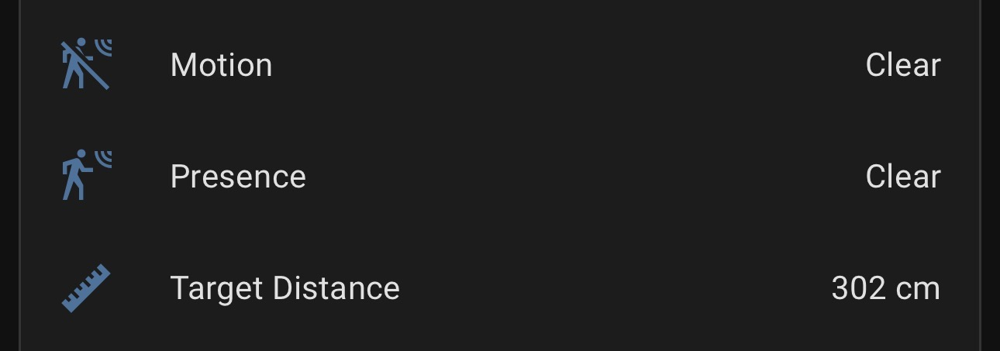
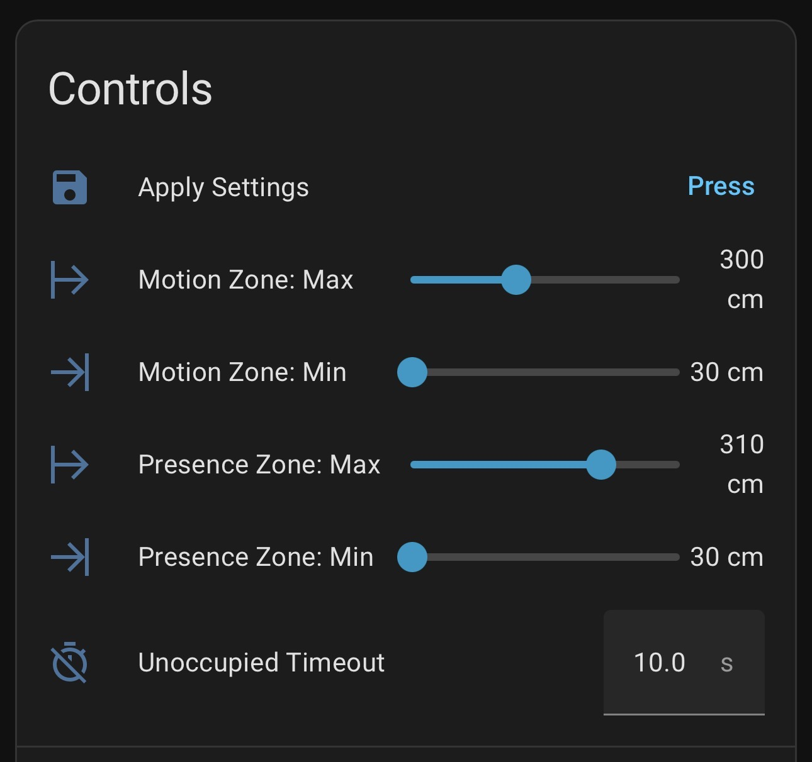
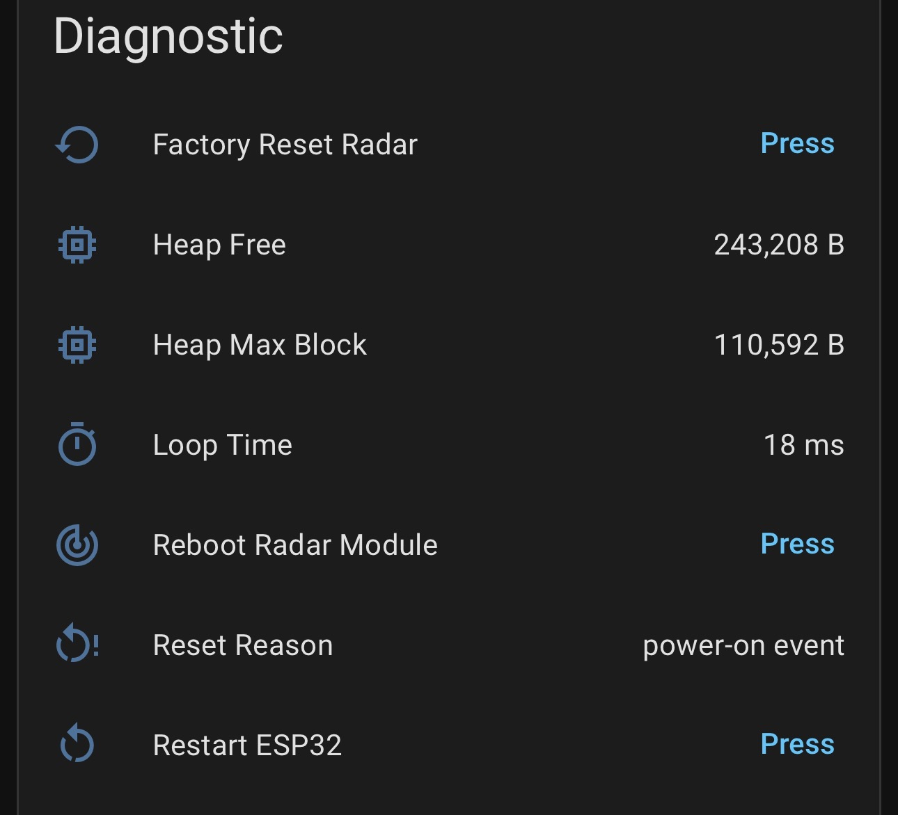

# esphome-ld2411s

[](https://github.com/DAB-LABS/esphome-ld2411s/actions/workflows/ci.yml)
[](https://github.com/DAB-LABS/esphome-ld2411s/releases)
[](LICENSE)
[](https://esphome.io)

An ESPHome external component for the **HLK-LD2411S** 24GHz mmWave presence sensor by Hi-Link.

The LD2411S provides independent **motion** and **presence** detection with configurable zones and distance reporting via UART. Unlike simpler radar sensors, it distinguishes between active movement and stationary occupancy — making it well suited for detecting someone sitting still at a desk or workbench.

---

## Features

- Binary **presence** sensor (occupancy detection, including stationary targets)
- Binary **motion** sensor (active movement detection)
- **Distance** sensor (target distance in cm)
- Configurable motion and presence detection zones (min/max in cm)
- Configurable unoccupied timeout
- Apply settings at runtime from Home Assistant — no reflash required
- Radar reboot and factory reset buttons
- **Bluetooth toggle** — enable/disable onboard BLE from Home Assistant
- Tested on ESP32-WROOM-32 with ESPHome 2026.2.4 and ESP-IDF framework

---

## Screenshots

| Sensors | Controls | Diagnostics |
|:---:|:---:|:---:|
|  |  |  |

**Sensors** — Live presence, motion, and target distance reported to Home Assistant.  
**Controls** — Runtime zone configuration with sliders. Adjust and press Apply Settings — no reflash needed.  
**Diagnostics** — Reset reason, heap health, loop time, and radar control buttons.

---

## Hardware

### Sensor
**HLK-LD2411S** — 24GHz mmWave radar module, UART interface, 256000 baud  
Available from Hi-Link and common electronics suppliers.

### Wiring

| LD2411S Pin | Color (typical) | ESP32 DevKit V1 Pin | Notes |
|---|---|---|---|
| VIN | Red | **VIN (5V)** | Must be 5V — **not** 3.3V |
| GND | Black | GND | |
| TXD | Green | GPIO16 (RX) | |
| RXD | Blue | GPIO17 (TX) | |
| OUT | Yellow | Not connected | Reserved — see note below |

> **⚠️ The LD2411S OUT pin is not functional.** Despite the label, this pin is hardwired to GND in the LD2411S firmware and does not toggle with presence or motion. Community testing has confirmed it stays low at all times. Do not connect it.

> **⚠️ The LD2411S requires 5V on VIN.** Wiring it to the ESP32's 3V3 pin will result in the sensor powering on but producing no UART output.

### Power Supply

A USB power supply rated at **1A (5W) minimum** is required. If you experience instability — frequent reboots, dropped WiFi, or sensors going unavailable — try a **2A (10W)** supply before chasing firmware issues.

The ESP32-WROOM-32 and LD2411S together can reach several hundred milliamps of combined peak draw — enough to cause voltage sag on a marginal supply. This is particularly likely during WiFi TX bursts where the ESP32 alone can spike significantly.

> **Tip:** If you see `Reset Reason: power-on event` repeating in ESPHome logs or HA diagnostics, the power supply is the most likely culprit. The diagnostic sensors in the example YAML expose reset reason directly in Home Assistant.

---

## Installation

Add the `external_components` block to your ESPHome YAML:

```yaml
external_components:
  - source: github://DAB-LABS/esphome-ld2411s
    components: [ld2411s]
```

ESPHome will fetch the component directly from this repository at build time.

---

## Configuration

### Minimal example

```yaml
external_components:
  - source: github://DAB-LABS/esphome-ld2411s
    components: [ld2411s]

uart:
  tx_pin: GPIO17
  rx_pin: GPIO16
  baud_rate: 256000
  parity: NONE
  stop_bits: 1

ld2411s:
  distance:
    name: "Target Distance"
  presence:
    name: "Presence"
  motion:
    name: "Motion"
```

### Full example

See [`example.yaml`](example.yaml) for a complete configuration including runtime zone controls, diagnostic sensors, and radar control buttons.

### Component options

```yaml
ld2411s:
  uart_id: uart_bus       # Required only if multiple UART buses are defined
  distance:
    name: "Target Distance"
  presence:
    name: "Presence"
    filters:
      - delayed_off: 10s  # Recommended: prevents flickering on exit
  motion:
    name: "Motion"
    filters:
      - delayed_off: 5s
```

All three sensors (`distance`, `presence`, `motion`) are optional.

---

## Detection Zones

The LD2411S supports two independently configurable detection zones:

| Zone | Purpose |
|---|---|
| **Motion zone** | Detects active movement |
| **Presence zone** | Detects stationary occupancy |

Zone values are in **centimeters**. Hardware minimum is **30cm**.

### Setting Zones at Runtime

The example YAML exposes `number` entities in Home Assistant for adjusting zones without reflashing. Here's how the workflow operates:

1. **Adjust the sliders** in HA for motion zone min/max, presence zone min/max, and unoccupied timeout.
   - Each slider release commits the value to the HA entity — you'll see this reflected in the HA activity log (e.g., `Motion Zone Max changed to 300`). This updates HA's local state but does **not yet** send a command to the radar.

2. **Press Apply Settings** once you've finished adjusting all values.
   - This executes the `send_config` script, which sends the full zone configuration to the radar in a single UART command. Set everything first, then apply once — there's no need to press Apply after each individual slider.

3. **Verify** by observing the Distance, Presence, and Motion entities respond from within the new zone boundaries.

### Slider vs. Text Input

Each `number` entity supports a `mode` option that controls how it appears in Home Assistant:

| Mode | Appearance | Best for |
|---|---|---|
| `slider` (default) | Drag control | Visual range adjustment |
| `box` | Text input field | Precise numeric entry |

To change the input mode, add `mode: box` (or `mode: slider`) to any number entity in your YAML:

```yaml
- platform: template
  name: "Motion Zone Max"
  mode: box   # precise text input instead of slider
  ...
```

The unoccupied timeout (0–6553 range) defaults to `box` in the example YAML, as a slider across that range is impractical.

### Unoccupied Timeout — How It Works

The **Unoccupied Timeout** entity is in **seconds** (0–6553 s). Internally, the component multiplies your value by 10 before sending it to the radar, because the protocol uses **100ms units** (range 0–65535 units). So a setting of `10 s` sends `100` to the hardware.

> Protocol unit = seconds × 10. Max supported value: 6553 s (~109 minutes).

### Presence Clear Time — Two Layers

The example YAML includes a software `delayed_off` filter on top of the hardware timeout:

```yaml
presence:
  filters:
    - delayed_off: 10s
motion:
  filters:
    - delayed_off: 5s
```

This means presence clears in HA after **two delays have elapsed**:

1. **Hardware unoccupied timeout** — the radar waits this long after the last detection before sending a "no target" frame over UART (default: 10 s)
2. **ESPHome `delayed_off` filter** — ESPHome holds the binary sensor `on` for an additional delay after receiving the "no target" frame (default: 10 s for presence, 5 s for motion)

With the defaults, presence won't clear in HA until approximately **20 seconds** after the last detected target, and motion until approximately **15 seconds**. Adjust either or both to tune responsiveness vs. false-off behavior for your use case.

If you want **both a slider and a text input** in the same card, the [`numberbox-card`](https://github.com/htmltiger/numberbox-card) HACS custom card renders both together and works with any existing `number` entity — no ESPHome changes needed.

### Known Issue: Radar Lock-Up After Zone Changes

The radar can become unresponsive after repeated zone adjustments — particularly when using the slider quickly or applying settings multiple times in rapid succession. Symptoms include:

- Sensors freeze and display the last known state
- Presence, Motion, and Distance entities go **unavailable** while other ESP sensors (WiFi signal, uptime, etc.) remain online

This appears to be a radar firmware issue — the sensor's internal state gets confused by rapid or successive configuration commands. A full ESPHome restart does **not** resolve it; only the radar itself needs to be rebooted.

**Fix:** Press the **Reboot Radar** button in Home Assistant. Sensors typically recover within a few seconds. Factory reset is not required.

> **Best practice:** Make all zone adjustments, press Apply Settings once, then leave it. Avoid sliding and applying repeatedly in quick succession.

---

## Bluetooth

The LD2411S has onboard BLE used by the **HLKRadarTool** app (iOS/Android) for wireless parameter configuration and firmware updates. BLE is **off by default** from the factory on the LD2411S (unlike the LD2410 which defaults to on).

The example YAML exposes a **Radar Bluetooth** switch in Home Assistant that lets you toggle BLE on or off without opening the app.

### Why you might want to turn it on

- Use HLKRadarTool over BLE to inspect or adjust radar parameters without serial access
- Firmware updates to the radar module

### Why you might want to leave it off

- Reduces RF noise if you're running ESPresense or other BLE tracking alongside this sensor
- Slightly reduces idle power draw
- Removes an unnecessary radio if you're never going to use the HLKRadarTool app

### How the switch works

The switch sends command `0x00A4` over UART with a value of `0x0100` (on) or `0x0000` (off). The sequence requires two phases: first commit the setting to radar flash via `End config`, then re-enter config mode and send the reboot command — the radar only accepts reboot while inside a config session.

```yaml
switch:
  - platform: template
    name: "Radar Bluetooth"
    id: radar_bluetooth
    optimistic: true
    restore_mode: RESTORE_DEFAULT_OFF
    entity_category: config
    icon: mdi:bluetooth
    turn_on_action:
      - uart.write: [0xFD, 0xFC, 0xFB, 0xFA, 0x04, 0x00, 0xFF, 0x00, 0x01, 0x00, 0x04, 0x03, 0x02, 0x01]  # Enable config
      - delay: 100ms
      - uart.write: [0xFD, 0xFC, 0xFB, 0xFA, 0x04, 0x00, 0xA4, 0x00, 0x01, 0x00, 0x04, 0x03, 0x02, 0x01]  # BT on
      - delay: 200ms
      - uart.write: [0xFD, 0xFC, 0xFB, 0xFA, 0x04, 0x00, 0xFE, 0x00, 0x01, 0x00, 0x04, 0x03, 0x02, 0x01]  # End config (commits to flash)
      - delay: 200ms
      - uart.write: [0xFD, 0xFC, 0xFB, 0xFA, 0x04, 0x00, 0xFF, 0x00, 0x01, 0x00, 0x04, 0x03, 0x02, 0x01]  # Re-enter config
      - delay: 100ms
      - uart.write: [0xFD, 0xFC, 0xFB, 0xFA, 0x02, 0x00, 0xA3, 0x00, 0x04, 0x03, 0x02, 0x01]              # Reboot radar
    turn_off_action:
      - uart.write: [0xFD, 0xFC, 0xFB, 0xFA, 0x04, 0x00, 0xFF, 0x00, 0x01, 0x00, 0x04, 0x03, 0x02, 0x01]  # Enable config
      - delay: 100ms
      - uart.write: [0xFD, 0xFC, 0xFB, 0xFA, 0x04, 0x00, 0xA4, 0x00, 0x00, 0x00, 0x04, 0x03, 0x02, 0x01]  # BT off
      - delay: 200ms
      - uart.write: [0xFD, 0xFC, 0xFB, 0xFA, 0x04, 0x00, 0xFE, 0x00, 0x01, 0x00, 0x04, 0x03, 0x02, 0x01]  # End config (commits to flash)
      - delay: 200ms
      - uart.write: [0xFD, 0xFC, 0xFB, 0xFA, 0x04, 0x00, 0xFF, 0x00, 0x01, 0x00, 0x04, 0x03, 0x02, 0x01]  # Re-enter config
      - delay: 100ms
      - uart.write: [0xFD, 0xFC, 0xFB, 0xFA, 0x02, 0x00, 0xA3, 0x00, 0x04, 0x03, 0x02, 0x01]              # Reboot radar
```

### Important notes

- **Toggling BT reboots the radar.** Sensors will be unavailable for a few seconds while it restarts — this is expected.
- **The switch is optimistic.** HA state updates immediately on toggle but is not confirmed over UART. The actual BT state is only verifiable by checking whether HLKRadarTool can discover the sensor over BLE.
- **`End config` must precede the reboot.** Without it, the BT setting is written to RAM only and is lost when the radar restarts. The two-phase sequence (commit, then reboot inside a fresh config session) is required for the change to persist.
- **Restore mode is `RESTORE_DEFAULT_OFF`** — matches the LD2411S factory default. Subsequent boots restore the last known state from ESP NVS flash.

---

## ESPHome & Framework Notes

### ESP-IDF framework recommended

```yaml
esp32:
  variant: esp32
  framework:
    type: esp-idf
```

ESP-IDF offers better FreeRTOS scheduler integration, a more reliable WiFi stack, lower memory overhead, and stricter watchdog behavior that makes crashes easier to identify and debug. These qualities matter for a device running continuous UART parsing alongside an active WiFi connection.

### UART wire length

Keep UART wiring (TX/RX) under ~50cm. At 256000 baud on 3.3V logic, signal integrity degrades on longer runs. Mount the ESP32 close to the sensor.

---

## Crash Diagnostics

The `debug` component exposes reset reason and heap health as HA entities. Useful for diagnosing power supply issues, watchdog resets, and memory problems.

```yaml
debug:
  update_interval: 30s

text_sensor:
  - platform: debug
    reset_reason:
      name: "Reset Reason"
      entity_category: diagnostic

sensor:
  - platform: debug
    free:
      name: "Heap Free"
      entity_category: diagnostic
    block:
      name: "Heap Max Block"
      entity_category: diagnostic
    loop_time:
      name: "Loop Time"
      entity_category: diagnostic
```

### Reset Reason reference

| Value | Meaning |
|---|---|
| `power-on event` | Full power loss — check USB supply or loose connections |
| `brownout` | Voltage sag — insufficient power supply |
| `Task watchdog` | Loop starving FreeRTOS scheduler |
| `Panic` | Firmware crash — check serial output for stack trace |
| `Software reset` | Clean restart (OTA, button, or HA restart entity) |

---

## Tested Environment

| Component | Version |
|---|---|
| ESPHome | 2026.2.4 |
| ESP-IDF | 5.5.2 |
| Home Assistant | 2026.2.3 |
| Board | ESP32-WROOM-32 (rev 3.1, dual-core, 4MB flash) |
| Sensor | HLK-LD2411S |

---

## License

MIT
